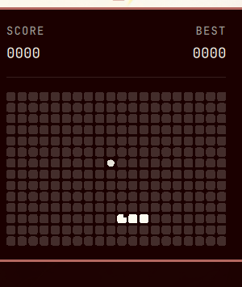

# Snake

A Nokia 3310-style Snake game for [Omarchy](https://omarchy.org)'s shell — lives as a small pixel-art icon in your bar and opens into a phone-style LCD panel. No external dependencies; the whole game (state, rendering, persistence) runs inside the shell.



## Install

```
omarchy plugin add https://github.com/titanicruby/omarchy-snake.git --enable
```

(Replace the URL with wherever you publish this repo. `--enable` places the icon in your bar immediately; drop it to review the code first and enable later from **Setup → Plugins**.)

For local development instead of a git install, drop this folder at `~/.config/omarchy/plugins/io.github.titanicruby.snake/` and run:

```
omarchy plugin enable io.github.titanicruby.snake
```

## Usage

Click the snake icon in the bar to open the panel. The start screen lets you pick a mode before playing:

| Key(s)              | Action                                      |
|----------------------|----------------------------------------------|
| Arrow keys / WASD / hjkl | Steer the snake                          |
| Space                | Start · pause/resume · restart after game over or a win |
| ← / → (or A / D)     | Change mode (Wrap / Solid) — start screen and game-over/win screens only |
| Esc                  | Close the panel (pauses mid-game). On the game-over/win screens: **exit** — resets back to the start screen for next time |

**Modes:**
- **Wrap** — the snake passes through the edges and comes out the opposite side.
- **Solid** — the walls are deadly.

Each mode tracks its own best score, and your last-picked mode is remembered for next time.

**Winning:** fill the entire grid with the snake (classic Snake's actual win condition) and you get a proper celebration — a diagonal light-wave sweep across the whole board.

Closing the panel mid-game pauses it; reopening shows the paused state rather than dropping you back in mid-tick. The game loop only runs while the panel is open, so the plugin uses no CPU while hidden.

## Removal

```
omarchy plugin remove io.github.titanicruby.snake
```

This unloads it from the bar immediately. If it's a hand-copied folder (not a git checkout) it gets moved to a timestamped backup inside `~/.config/omarchy/plugins/` rather than deleted outright.

**Heads up:** disabling or removing a third-party bar-widget plugin (this one included) resets its saved best scores and last-picked mode. That's not a bug in this plugin — for third-party bar widgets, Omarchy's shell treats "enabled" as "present in `shell.json`'s bar layout at all," and the plugin's settings live inline on that same entry, so removing the entry removes the settings with it. If you want to keep your scores, don't disable/remove the plugin — just close the panel or disable your Hyprland session as usual.

## Support

Scan to buy me a coffee:


## Development notes

- `manifest.json` — plugin manifest (`kinds: ["bar-widget"]`; the panel is loaded internally via a `Loader` in `BarWidget.qml`, not a separate `panel` kind).
- `BarWidget.qml` — the bar icon (hand-placed pixel blocks, not a font glyph) and the open/close/toggle forwarding to the panel.
- `Panel.qml` — the LCD panel: chrome, header, grid rendering, and all screen-state UI (start/playing/paused/game-over/win). Reads game state; doesn't own it.
- `GameLogic.js` — the actual game: snake position, direction buffering, collision, food, win condition. Pure JS, no QML dependency, kept separate so it can be read/changed/tested independently of rendering.

Colors come entirely from the active Omarchy theme (`Color.background` / `Color.foreground` via `qs.Commons`) — there are no hardcoded colors, so the panel and icon adapt automatically on theme change, including live while the panel is open.

If you edit `GameLogic.js` yourself and a change doesn't seem to take effect even after `omarchy-restart-shell`, clear Quickshell's compiled-JS cache first:

```
rm -rf ~/.cache/quickshell/qmlcache/*
```

Each grid cell's `opacity` is a plain binding (`isDraining ? drainFade : (isFood ? foodFade : 1.0)`), never an imperative assignment — the game-over drain and food-blink animations only ever write to the scratch `drainFade`/`foodFade` properties, and the binding falls back to `1.0` on its own the instant a cell stops draining/blinking. Don't reintroduce a pattern where an animation writes `cell.opacity` directly and something else tries to reset it afterward (e.g. an `onRunningChanged` handler) — a one-shot animation's `running` can drop to `false` just from finishing naturally, well before the state that's supposed to trigger the reset actually changes, so the reset can silently never fire. That was the root cause of a real bug here: cells from a dead snake stayed dimmed forever in the next game because the reset relied on a `running` transition that had already happened for an unrelated reason.

## License

MIT — see [LICENSE](LICENSE).
